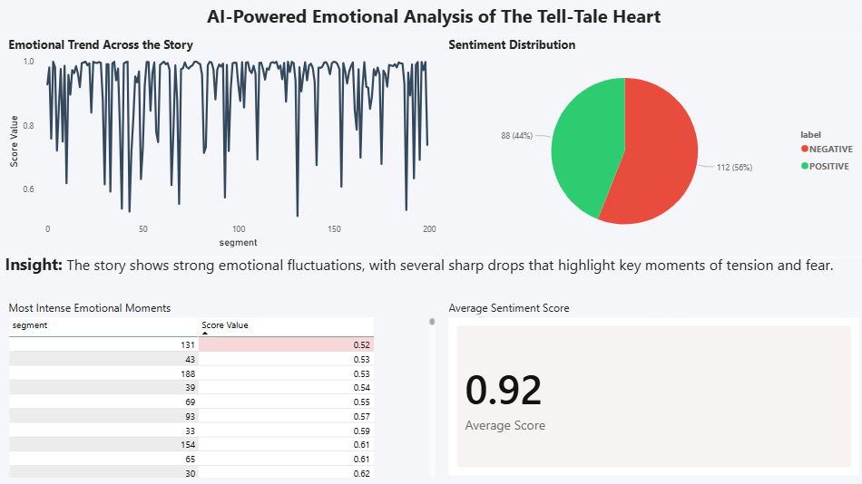

# AI-Powered Emotional Analysis of The Tell-Tale Heart

This project explores how we can track emotional patterns within a story using basic NLP techniques and transform them into an interactive dashboard using Power BI.

---

## 📊 Project Overview

Using *"The Tell-Tale Heart"* by Edgar Allan Poe, the text was segmented into smaller parts and analyzed to detect sentiment across the narrative.

The goal was to transform unstructured text into a structured dataset and uncover emotional trends over time.

---

## 🔍 Key Insights

- The story appears mostly positive overall (~56%)
- However, it contains frequent sharp emotional drops
- These drops highlight moments of tension and psychological intensity

---

## 📈 Dashboard Preview

---

## 🛠 Tools Used

- Python (Text Processing & Sentiment Analysis)
- Power BI (Data Visualization)

---

## 📁 Project Structure
├── nlp_emotional_analysis.ipynb # NLP analysis

├── story.txt # Original text

├── story_sentiment.csv # Processed dataset

├── dashboard/
│ └──dashboard.png # Power BI dashboard

---

## 🚀 Workflow

1. Load and clean text data
2. Split text into segments
3. Apply sentiment analysis
4. Generate structured dataset
5. Build interactive dashboard in Power BI

---

## 💡 What I Learned

- How to convert unstructured text into analyzable data
- Applying basic NLP techniques in real use cases
- Building clean and insightful dashboards
- Storytelling using data visualization

---

## 📌 Notes

This project uses basic NLP techniques and is intended as a practical exploration of combining text analysis with data visualization.

---

Feel free to explore the project or reach out for any questions!
